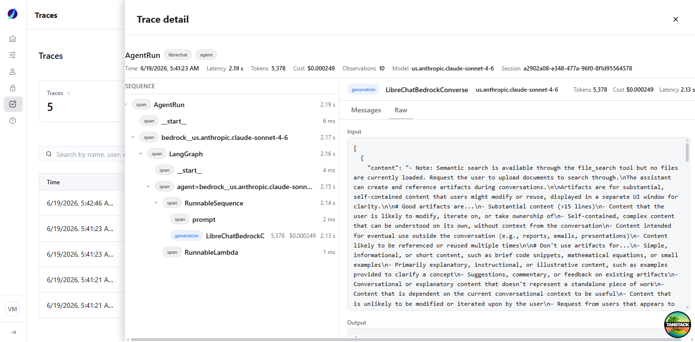

# Traces Page

LLM observability for the platform, surfaced in the admin panel. The page is a
read-only view over the **trace-collector** telemetry store (ClickHouse): it
lists traces, rolls up cost/token/latency metrics per tenant, and opens an
individual trace in a right-side drawer.

The drawer follows an **Opik-style layout**: a **Sequence** pane on the left (the
collapsible span tree) and a **detail** pane on the right with **Messages** and
**Raw** tabs. Messages render the request → response conversation (and any span's
I/O) as role-coded chat bubbles with **markdown**; Raw shows the pretty-printed
JSON payload. A header strip carries inline metrics (time, latency, tokens, cost,
observations, model, session).

It is brand-neutral: no product names appear in the UI, types, or queries.

## Where things live

| Concern                          | File                                            |
| -------------------------------- | ----------------------------------------------- |
| Route (list + drawer)            | `src/routes/_app/traces.index.tsx`              |
| Route (full-page deep link)      | `src/routes/_app/traces.$traceId.tsx`           |
| Page shell (filters, table)      | `src/components/traces/TracesPage.tsx`          |
| Right-side drawer                | `src/components/traces/TraceDrawer.tsx`         |
| Detail layout (header + 2-pane)  | `src/components/traces/TraceDetailContent.tsx`  |
| Sequence pane (span tree)        | `src/components/traces/TraceSequence.tsx`       |
| Detail pane (Messages/Raw tabs)  | `src/components/traces/TraceNodeDetail.tsx`     |
| Chat message bubbles             | `src/components/traces/MessageList.tsx`         |
| Markdown renderer (shared)       | `src/components/shared/Markdown.tsx`            |
| `isStringMarkdown` heuristic     | `src/utils/markdown.ts`                         |
| User + circular avatar           | `src/components/traces/UserCell.tsx`            |
| Display formatters               | `src/components/traces/format.ts`               |
| Server functions (queries)       | `src/server/traces.ts`                          |
| Pure helpers (tree + messages)   | `src/server/traces.logic.ts`                    |
| ClickHouse client (server)       | `src/server/utils/clickhouse.ts`                |
| Types                            | `src/types/traces.ts`                           |

## Data flow

```
ClickHouse (trace-collector tables: traces, observations, scores)
   │  read-only, tenant-scoped, parameterized SQL
   ▼
src/server/traces.ts          createServerFn handlers (run server-side only)
   │  - buildTree(): flat observations → span tree
   │  - extractMessages()/deriveConversation(): serialized LangChain/LangGraph
   │    message payloads → clean role/text conversation (Request → Response)
   ▼
src/components/traces/*        TracesPage → TraceDrawer → TraceDetailContent
                               → TraceSequence (left) + TraceNodeDetail (right)
```

- **`createServerFn`** keeps the ClickHouse client and credentials on the server;
  the browser only ever sees the shaped result.
- **Message extraction is server-side.** Producers store I/O as serialized
  LangChain message objects (not plain text). The server parses them into a
  `{role, text}` conversation and attaches `inputMessages`/`outputMessages` per
  observation, so the client just renders (markdown via `react-markdown`).
- **React Query** caches by tenant/filters; the drawer fetches the detail lazily
  when a `trace` search param is present.

## Enterprise properties

- **Server-side pagination.** `getTracesFn` pages with `LIMIT/OFFSET` and a
  separate `count()` — the client never loads the full table. `pageSize` is
  bounded (`MAX_PAGE_SIZE = 100`).
- **Tenant isolation.** Every query is filtered by `tenant_id`. The tenant comes
  from the dropdown (URL search param), backed by `getTenantsFn`.
- **Latest-wins + soft-delete.** All reads use `FINAL` (ReplacingMergeTree) and
  `is_deleted = 0`, matching the collector's versioning model.
- **Parameterized SQL.** All user-controlled values (tenant, search, paging) are
  passed as ClickHouse query params — never string-interpolated.
- **Real user resolution.** `UserCell` resolves a trace's `user_id` to the actual
  platform user (name + avatar) via the existing users query; falls back to the
  raw id when unknown.
- **URL as source of truth.** Tenant, search, range, page, and the open trace are
  all encoded in the route search params, so views are shareable and reloadable.

## Configuration

The ClickHouse connection is read from the environment (server-only):

| Variable             | Default                  | Purpose                  |
| -------------------- | ------------------------ | ------------------------ |
| `CLICKHOUSE_URL`     | `http://localhost:8123`  | Collector ClickHouse URL |
| `CLICKHOUSE_USER`    | `default`                | Read user                |
| `CLICKHOUSE_PASSWORD`| (empty)                  | Read password            |
| `CLICKHOUSE_DB`      | `default`                | Database                 |

`API_SERVER_URL` must point at the chat application (for admin auth + user
resolution). In this workspace that is `http://localhost:3090`.

## Tests

Pure logic is unit-tested without a ClickHouse connection:

- `src/server/traces.logic.test.ts` — `buildTree` (nesting, orphans, roots),
  `rangeClause` (interval SQL), `toNumber` (ClickHouse string coercion),
  `messageText`/`extractMessages`/`deriveConversation` (LangChain + plain message
  parsing, role inference, JSON rejection).
- `src/components/traces/format.test.ts` — cost/token/latency/time formatting and
  observation badge state.

Run: `bun run test -- --run src/server/traces.logic.test.ts src/components/traces/format.test.ts`

## Screenshots

| List | Trace drawer (Messages) | Trace drawer (Raw) |
| ---- | ----------------------- | ------------------ |
|  |  |  |
