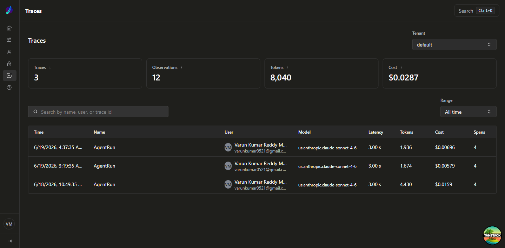
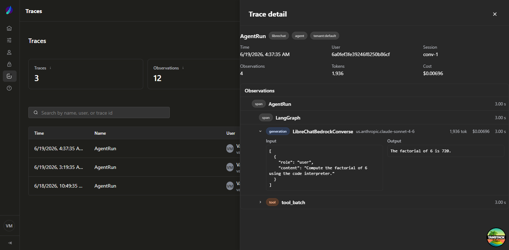

# Traces Page

LLM observability for the platform, surfaced in the admin panel. The page is a
read-only view over the **trace-collector** telemetry store (ClickHouse): it
lists traces, rolls up cost/token/latency metrics per tenant, and opens an
individual trace as a right-side drawer showing the full observation tree
(spans → generations → tool calls) with per-node I/O, model, tokens, and cost.

It is brand-neutral: no product names appear in the UI, types, or queries.

## Where things live

| Concern                       | File                                            |
| ----------------------------- | ----------------------------------------------- |
| Route (list + drawer)         | `src/routes/_app/traces.index.tsx`              |
| Route (full-page deep link)   | `src/routes/_app/traces.$traceId.tsx`           |
| Page shell (filters, table)   | `src/components/traces/TracesPage.tsx`          |
| Right-side drawer             | `src/components/traces/TraceDrawer.tsx`         |
| Shared detail (header + tree) | `src/components/traces/TraceDetailContent.tsx`  |
| Observation tree (waterfall)  | `src/components/traces/ObservationTree.tsx`     |
| User + avatar resolution      | `src/components/traces/UserCell.tsx`            |
| Display formatters            | `src/components/traces/format.ts`               |
| Server functions (queries)    | `src/server/traces.ts`                          |
| Pure query/tree helpers       | `src/server/traces.logic.ts`                    |
| ClickHouse client (server)    | `src/server/utils/clickhouse.ts`                |
| Types                         | `src/types/traces.ts`                           |

## Data flow

```
ClickHouse (trace-collector tables: traces, observations, scores)
   │  read-only, tenant-scoped, parameterized SQL
   ▼
src/server/traces.ts          createServerFn handlers (run server-side only)
   │  React Query (queryOptions in the same module)
   ▼
src/components/traces/*        TracesPage → TraceDrawer → TraceDetailContent
```

- **`createServerFn`** keeps the ClickHouse client and credentials on the server;
  the browser only ever sees the shaped result.
- **React Query** caches by tenant/filters; the drawer fetches the detail lazily
  when a `trace` search param is present.

## Enterprise properties

- **Server-side pagination.** `getTracesFn` pages with `LIMIT/OFFSET` and a
  separate `count()` — the client never loads the full table. `pageSize` is
  bounded (`MAX_PAGE_SIZE = 100`).
- **Tenant isolation.** Every query is filtered by `tenant_id`. The tenant comes
  from the dropdown (URL search param), backed by `getTenantsFn`.
- **Latest-wins + soft-delete.** All reads use `FINAL` (ReplacingMergeTree) and
  `is_deleted = 0`, matching the collector's versioning model.
- **Parameterized SQL.** All user-controlled values (tenant, search, paging) are
  passed as ClickHouse query params — never string-interpolated.
- **Real user resolution.** `UserCell` resolves a trace's `user_id` to the actual
  platform user (name + avatar) via the existing users query; falls back to the
  raw id when unknown.
- **URL as source of truth.** Tenant, search, range, page, and the open trace are
  all encoded in the route search params, so views are shareable and reloadable.

## Configuration

The ClickHouse connection is read from the environment (server-only):

| Variable             | Default                  | Purpose                  |
| -------------------- | ------------------------ | ------------------------ |
| `CLICKHOUSE_URL`     | `http://localhost:8123`  | Collector ClickHouse URL |
| `CLICKHOUSE_USER`    | `default`                | Read user                |
| `CLICKHOUSE_PASSWORD`| (empty)                  | Read password            |
| `CLICKHOUSE_DB`      | `default`                | Database                 |

`API_SERVER_URL` must point at the chat application (for admin auth + user
resolution). In this workspace that is `http://localhost:3090`.

## Tests

Pure logic is unit-tested without a ClickHouse connection:

- `src/server/traces.logic.test.ts` — `buildTree` (nesting, orphans, roots),
  `rangeClause` (interval SQL), `toNumber` (ClickHouse string coercion).
- `src/components/traces/format.test.ts` — cost/token/latency/time formatting and
  observation badge state.

Run: `bun run test -- --run src/server/traces.logic.test.ts src/components/traces/format.test.ts`

## Screenshots

| List | Trace drawer |
| ---- | ------------ |
|  |  |
